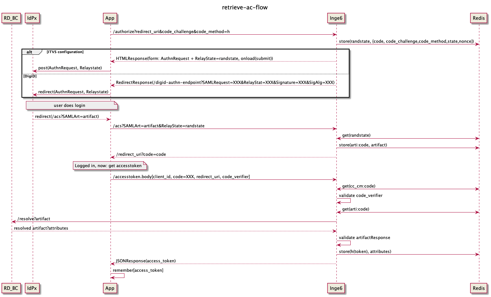

# System summary
 Inge6 is build as a bridge between the CoronaCheck app and TVS (Toegang Verlenings Service) or DigiD. It allows a end-user to login into digid and provide the app with a token, which can be used to retrieve the BSN of that same end-user. This BSN is used in inge4 to retrieve the related vaccination and test data from the existing provider.

 
 *Flow of retrieving an access token. Throughout the first part of the flow (after /authorize), the call is directly linked to some randstate (generated directly after the first call). The latter part of the flow that same user is linked using the generated code coupled to that randstate. Using these random state parameters we track the user throughout the complete flow, and seperate that user from other users interacting with the system*

# Setup

As Inge6 is a OIDC <-> SAML bridge, one has to have files for both. Each file is described below. Further, one needs to create an `inge6.conf` to define all settings. An example is found in inge6.conf.example with the corresponding explanations. To make use of all default settings, a single run of `make setup` should be sufficient. Allowing you to run the service on all default settings. 

For a more detailed view on the setup, please have a look in the `/docs` folder.

## JWT keys
Inge6 needs two keys to encrypt and sign the JWT containing the BSN details. This is a Ed25519 keypair on Inge6 part, and a X25519 keypair for the requesting party (inge4). To generate a Ed25519 keypair one can perform the following code:
```python
>>> import base64
>>> from cryptography.hazmat.primitives.asymmetric.ed25519 import Ed25519PrivateKey, Ed25519PublicKey
>>> from cryptography.hazmat.primitives import serialization
# To generate a new key
>>> privkey = Ed25519PrivateKey.generate()
>>> privkey_bytes = privkey.private_bytes(
...     encoding=serialization.Encoding.Raw,
...     format=serialization.PrivateFormat.Raw,
...     encryption_algorithm=serialization.NoEncryption()
... )
# print base64 private key
>>> base64_privkey = base64.b64encode(privkey_bytes)
# To load a key from a base64 encoded key
>>> privkey_bytes = base64.b64decode(base64_privkey)
>>> loaded_privkey = Ed25519PrivateKey.from_private_bytes(privkey_bytes)
# To get the pubkey
>>> pubkey_bytes = privkey.public_key().public_bytes(
...     encoding=serialization.Encoding.Raw,
...     format=serialization.PublicFormat.Raw
... )
>>> base64_pubkey = base64.b64encode(pubkey_bytes)
```

The code is identical for creating a X25519 key, but then just needs a different import (and use the similar classes for loading and generation of the keys):
```python
>>> from cryptography.hazmat.primitives.asymmetric.x25519 import X25519PrivateKey, X25519PublicKey
```

## Ubuntu dependencies
Some Ubuntu dependencies that should be installed:
`libxmlsec1-dev pkg-config`

# Using the ratelimiter
To activate an overflow IDP, secundairy IDP when primary is too busy, the following settings should be configured in the inge6.conf settings.

Further redis expects the keys configured in the config to have a valid value. The keys expected to be set are defined in the config under the following names:
- `primary_idp_key`
- `user_limit_key` (if there is an user limit to be handled by the ratelimiter)

Optionally, to enable ratelimit overflow, extra keys are expected to be set. The names of these keys are defined in the config under the following config names:
- `overflow_idp_key`
- `user_limit_key_overflow_idp` (if there is an user limit on the overflow idp to be handled by the ratelimiter)


# Using the mock environment
For development purposes we have created a 'backdoor' to retrieve a JWT Token for arbitrary BSNs, only available when `mock_digid` is True in the settings file. This setting enables two things:
1. The program flow is altered. By default we do not connect to the actual IdP, instead an 'end-user' is allowed to input an arbitrary BSN and retrieve a corresponding token. However, it still allows for connecting to the actual IdP if that is requested.
2. An additional endpoint is available `/consume_bsn`. This endpoint allows external tools and test services to let Inge6 consume a bsn and return a 'code'. This code can then be used in the `accesstoken_endpoint`, the accesstoken endpoint defined in the settings file, to retrieve a JWT token that corresponds to the provided bsn.

A code example on the second case:
```python
import json
import urllib.parse
import requests

from fastapi.responses import JSONResponse

inge6_mock_uri = "development.inge6.uri/"
redirect_uri = "some.allowlisted.uri"

authorize_params = {
    'client_id': "test_client",
    'redirect_uri': redirect_uri,
    'response_type': "code",
    'nonce': "n-0S6_WzA2Mj",
    'state': "af0ifjsldkj",
    'scope': "openid",
    'code_challenge': "_1f8tFjAtu6D1Df-GOyDPoMjCJdEvaSWsnqR6SLpzsw", # code_verifier : SoOEDN-mZKNhw7Mc52VXxyiqTvFB3mod36MwPru253c
    'code_challenge_method': "S256",
}

query_params: str = urllib.parse.urlencode(authorize_params)
bsn: str = '999991772'
resp: JSONResponse = requests.get(f'{inge6_mock_uri}/consume_bsn/{bsn}?{query_params}')
if (resp.status_code != 200):
    print('failed consume_bsn request: ', resp.status_code, resp.reason)

code = json.loads(resp.content.decode())['code'][0]
code_verifier = 'SoOEDN-mZKNhw7Mc52VXxyiqTvFB3mod36MwPru253c'
acc_req_body = f'client_id=test_client&redirect_uri={redirect_uri}&code={code}&code_verifier={code_verifier}&grant_type=authorization_code'

accesstoken_resp: JSONResponse = requests.post(f'{inge6_mock_uri}/accesstoken', acc_req_body)
if (resp.status_code != 200):
    print('failed accesstoken request: ', resp.status_code, resp.body)

accesstoken = json.loads(accesstoken_resp.content.decode())
```


It is the responsibility of the client to generate a unique code_verifier and code_challenge pair. To make sure that the code_verifier is cryptographically secure one should use the following definition (as defined in: https://datatracker.ietf.org/doc/html/rfc7636#section-4.1):
```
code_verifier = high-entropy cryptographic random STRING using the
unreserved characters [A-Z] / [a-z] / [0-9] / "-" / "." / "_" / "~"
from Section 2.3 of [RFC3986], with a minimum length of 43 characters
and a maximum length of 128 characters.
```

To find the code in this library used for verifying the code_verifier and code_challenge pair, have a look at the code snippet highlighted in the following github permalink:
https://github.com/91divoc-ln/inge-6/blob/e858cb2807cd270d3ca7e9c67b7fccc556a0f91d/inge6/oidc/authorize.py#L17-L49

This snippet verifies the pair as defined in https://datatracker.ietf.org/doc/html/rfc7636#section-4.2
